# Rally

> 한 화면의 시세를 보고, 여러 휴대폰이 같은 라운드를 즐기는 실시간 파티 데모

Rally는 호스트의 대형 화면과 손님의 모바일 화면을 Socket.IO로 연결한 가상 크레딧 파티 서비스입니다. 호스트는 라운드·이벤트·주문을 관리하고, 손님은 같은 시세 흐름 안에서 가상 크레딧으로 참여하거나 상품을 주문·선물할 수 있습니다.

해커톤 결과물입니다. 모든 크레딧과 결제 화면은 시연용입니다.

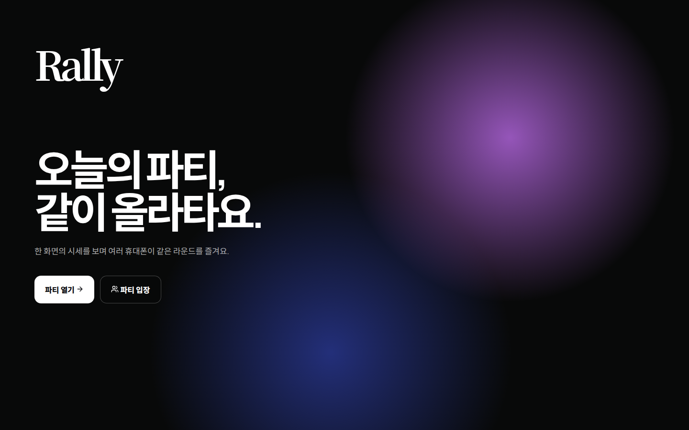

## 화면

### 시작·호스트

| 시작 화면 | 호스트 실시간 화면 |
| --- | --- |
|  | 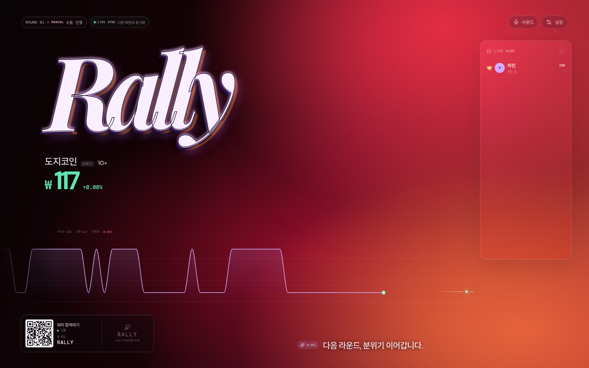 |

| 입장 정보 검증 | 호스트 설정 |
| --- | --- |
| 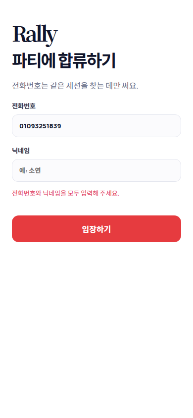 | 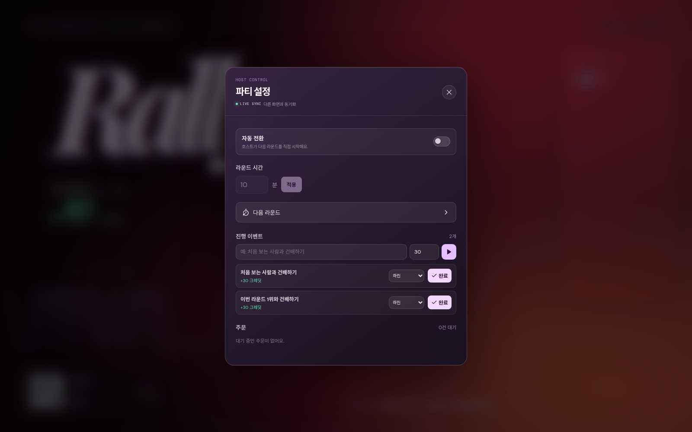 |

### 손님 모바일

| 투자 시작 | 참여 뒤 포지션 |
| --- | --- |
| 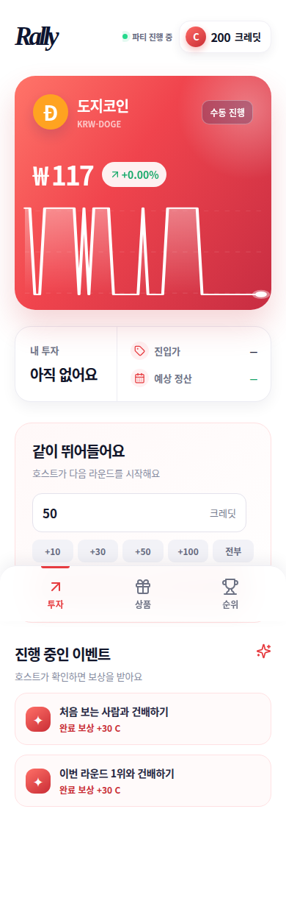 | 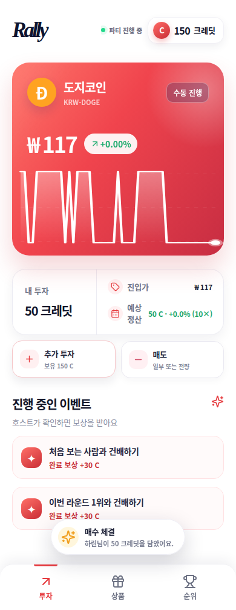 |

| 상품 주문 | 받는 사람 선택 |
| --- | --- |
| 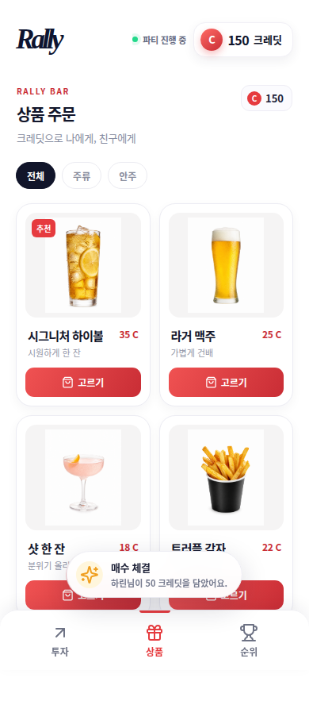 | 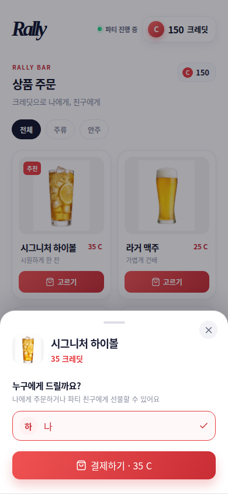 |

| 실시간 순위 | 충전 금액·수단 선택 |
| --- | --- |
| 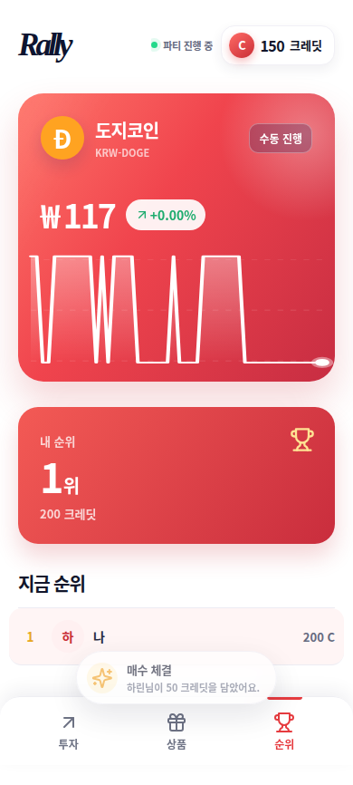 | 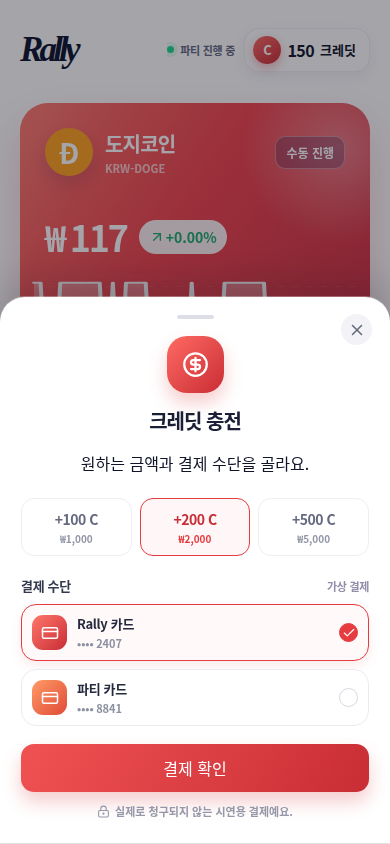 |

| 결제 확인 | 충전 완료 |
| --- | --- |
| 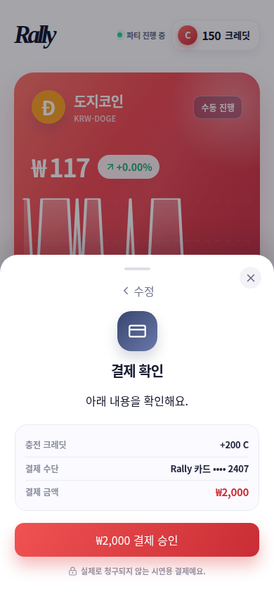 | 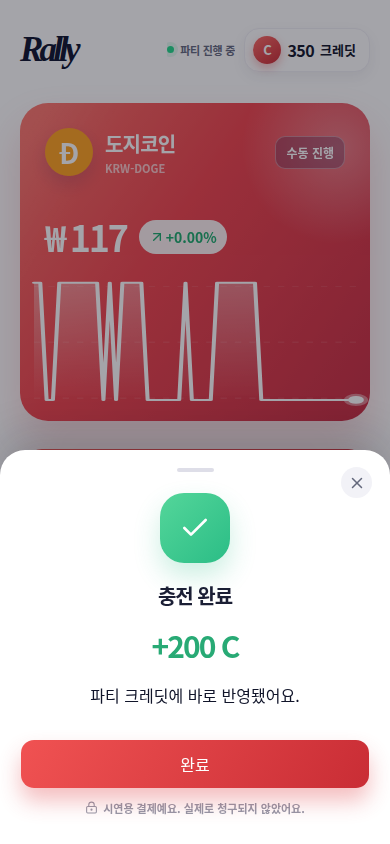 |

## 핵심 경험

- 호스트는 QR과 고정 방 코드 `RALLY`를 보여 주고, 넓은 화면에서 현재 종목·차트·참여자 순위·AI MC 멘트를 함께 띄웁니다.
- 손님은 전화번호와 닉네임으로 같은 파티에 들어와 가상 크레딧을 사용합니다. 새로고침 후에는 저장된 세션으로 다시 연결합니다.
- 모든 참여자의 시세, 포지션, 순위, 이벤트와 주문 상태는 Socket.IO의 단일 파티 상태로 동기화됩니다.
- 호스트는 수동 또는 자동으로 라운드를 넘기고, 이벤트 보상과 주문 서빙을 처리할 수 있습니다.
- 손님은 투자, 추가 투자, 정리, 시연용 크레딧 충전, 나에게 주문, 친구에게 선물을 이용할 수 있습니다.

## 동작 구조

```text
호스트 대형 화면 ─┐
                  ├─ Socket.IO ─ 단일 Rally 파티 상태 ─ 호스트·손님 화면에 즉시 반영
손님 모바일 화면 ─┘
                  └─ 업비트 공개 ticker → 시세·차트 갱신
```

- 서버는 시작 시 단일 기본 파티(`RALLY`)를 준비합니다.
- 시세는 업비트 공개 ticker를 우선 사용합니다. ticker가 늦거나 끊기면 마지막 실제 가격을 유지하고, 아직 가격을 받지 못한 경우에만 `DEMO` 이력을 사용합니다.
- Gemini는 AI MC 문구를 위한 선택 기능입니다. 키가 없거나 호출에 실패해도 준비된 문구로 파티가 계속 진행됩니다.

## 빠른 실행

요구 사항: Node.js 22 이상과 npm

```bash
npm install
npm run dev
```

개발 화면은 `http://localhost:5173`, 실시간 서버는 `http://localhost:8829`에서 실행됩니다. Vite가 `/api`와 `/socket.io` 요청을 실시간 서버로 전달합니다.

프로덕션 번들은 다음처럼 실행합니다.

```bash
npm run build
npm start
```

프로덕션 서버는 기본적으로 `http://localhost:8829`에서 `dist`와 Socket.IO를 함께 제공합니다. 포트를 바꾸려면 `PORT` 환경변수를 사용합니다.

## 접속 경로

| 경로 | 용도 |
| --- | --- |
| `/` | 시작 화면. 호스트 화면을 열거나 손님 입장으로 이동합니다. |
| `/host` | 이미 열린 파티의 호스트 미러 화면에 연결합니다. |
| `/join` | 손님 입장 화면입니다. |
| `/join/RALLY` | QR 초대에 쓰는 기본 입장 경로입니다. |
| `/api/health` | `{ ok, service, rooms, uptimeSeconds }` 상태를 반환합니다. |

## 설정

`.env.example`을 참고해 필요할 때만 환경변수를 설정합니다.

| 변수 | 필수 | 설명 |
| --- | --- | --- |
| `PORT` | N | 서버 포트입니다. 기본값은 `8829`입니다. |
| `GEMINI_API_KEY` | N | AI MC 문구 생성에만 사용합니다. 없거나 실패해도 fallback 문구를 사용합니다. |
| `UPBIT_ACCESS_KEY` / `UPBIT_SECRET_KEY` | N | 현재 공개 ticker에는 필요하지 않습니다. 브라우저용 `VITE_` 접두사는 사용하지 않습니다. |

## 검증 명령

```bash
npm run build
npm run lint
npx tsx --test server/index.test.ts
```

Socket.IO 이벤트와 payload는 [server/CONTRACT.md](server/CONTRACT.md)에 정리되어 있습니다. 구현의 화면 원칙은 [DESIGN_SPEC.md](DESIGN_SPEC.md)에서 확인할 수 있습니다.

## 프로젝트 구성

```text
src/
  components/       호스트·손님 React 화면과 스타일
  lib/realtime.ts   Socket.IO 연결과 acknowledgement 처리
server/
  index.ts          파티 상태, 실시간 이벤트, ticker fallback, HTTP health
  CONTRACT.md       클라이언트와 서버 사이의 실시간 계약
public/products/    주문 상품 이미지
docs/screenshots/   README에 쓰는 실제 브라우저 캡처
```

